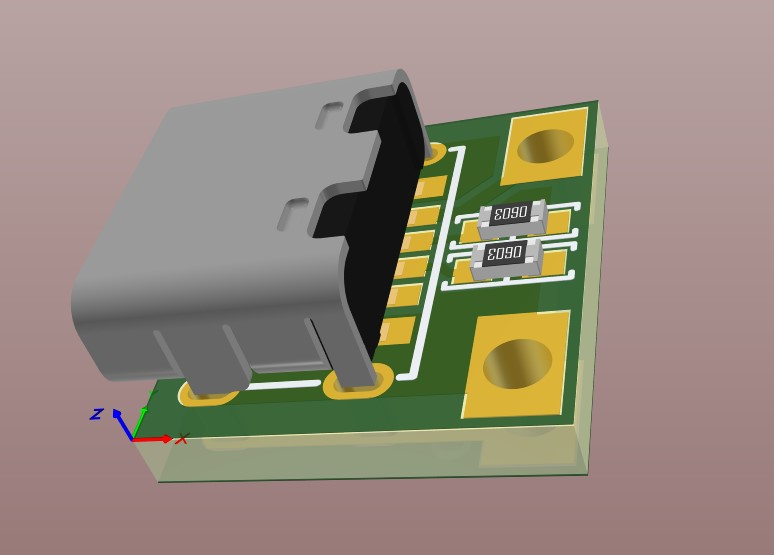

# salt-energy

## Introduction

This project provides practical solutions for repurposing disposable vape batteries to power devices like power banks and other rechargeable electronics. 
By transforming these short-lived products into useful, long-lasting devices, we aim to reduce electronic waste and extend the life cycle of valuable components.

Through this project, you'll learn how to convert the batteries from disposable vapes into reliable power sources, contributing to a more sustainable future. 
Whether you're an eco-conscious creator or a DIY enthusiast, this guide offers straightforward solutions for reducing waste and promoting energy efficiency.

## Vape batteries

Each device contains `li-ion` battery that in most cases can be categorized as follows:

### 1. Flat battery

- Cell Model: unknown
- Size: 80mm x 14mm x 37mm
- Li-ion 3.7V 400mAh

### 2. Round big battery

- Cell Model: 13400
- Size: 13mm x 40mm
- Li-ion 3.7V 550mAh

### 3. Round small battery

- Cell Model: 13300
- Size: 13mm x 30mm
- Li-ion 3.7V 400mAh

All project utilize one or many of this batteries

## Table of Contents

- [Salt AA Battery](#salt-aa-battery)
- [Ptero Power Bank](#ptero-power-bank)

## Salt AA Battery

Rechargeable rectangular AA battery, with discharge current up to 2A and quiescent current <25uA

### Specification

- Size: mm x mm x mm
- Capacity: 400 mAh
- Battery count: 1
- Battery type: [Flat battery](#1-flat-battery)

#### Battery PCB

The heart of this battery is custom designed board with charger(`TP4057`), protection(`XB7608A`) and step-down converter(`TPS62A02`).

#### USB type C PCB

#### JLCPCB quote example

 
 

***Note:*** All required fabrication and BOM can be found in `altium` directory.

### Prerequisites

The project contains `solidworks` source models and `stl` directory with all required models for 3D printing.
All that needs to assembly single device:
- 1x - Battery (see [Specification](#specification))
- 2x - Battery contacts (***Only positive contact required***). Can be found in `Aliexpress`, `Ebay` or `Amazon` by description: `Battery AA AAA Battery Positive to Negative Spring Plate Set`
    - Material: Metal 
    - Fit for: AA, AAA Batteries
    - Length: 9mm（0.35in, Wide: 8mm（0.31in）
- 1x -`main-board` -> ***Soldered***
- 1x -`usb-board` -> ***Soldered***
- 1x -`battery_aa_case.STL` -> ***Resolution: 0.1, Walls: 1, Infill: 100%, Supports: Yes, Filament material: PLA***
- 1x -`battery_aa_lid.STL` -> ***Resolution: 0.1, Walls: 1, Infill: 100%, Supports: Yes, Filament material: PLA***
  
***Additional:*** Some wires and epoxy or adhesive(B-7000) glue required

### Assembly

#### 1. Prepare Battery Contacts And Solder USB Wires

#### 2. Solder Main PCB To Battery

***Note:*** Do not forget to put isolator between battery terminals

#### 3. Set USB PCB To The Case

 
 

#### 4. Insert Battery And Board To The Case

- 
- 

#### 5. Glue Up Positive And Negative Contacts

- 
- 
- 

#### 6. Solder Positive, Negative And USB Contacts To Battery PCB

#### 7. Check That Charger Works And Battery Output 1.5V

- 
- 

#### 8. Glue Up Battery Lid

- 
- 

#### 9. Fully Charge Battery

---

## Ptero Power Bank

Cheap and powerful power bank with quick charge support

### Specification

- Size: 165mm x 74mm x 22mm
- Capacity: 9200 mAh
- Battery count: 23
- Battery type: [Flat battery](#1-flat-battery)

Based on the popular power bank charging module:

Can be found in `Aliexpress` or `Amazon` by number: `H961-U` or by description: `Dual USB 5V 2.4A Micro/Type-C USB Mobile`

### Prerequisites

The project contains `SolidWorks` source models and `stl` directory with all required models for 3D printing.
All that needs to assembly single device:
- 23x - Batteries (see [Specification](#specification))
- 1x - Power Bank PCB
- 6x - M3 bolts 10-14mm
- 6x - M3 brass inserts (4-6mm x 4.2mm)
- 1x -`body_top.STL` -> ***Resolution: 0.2, Walls: 2–3, Infill: 50%+, Supports: No, Filament material: PLA***
- 1x -`body_bottom.STL` -> ***Resolution: 0.2, Walls: 2–3, Infill: 50%+, Supports: Yes, Filament material: PLA***
- 2x -`battery_holder_8x.STL` -> ***Resolution: 0.2, Walls: 1, Infill: 100%, Supports: No, Filament material: PLA***
- 1x -`battery_holder_7x.STL` -> ***Resolution: 0.2, Walls: 1, Infill: 100%, Supports: Yes, Filament material: PLA***
- 1x -`display_glass.STL` -> ***Resolution: 0.12, Walls: 2, Infill: 2%, Supports: No, Filament material: Transparent PLA***
- 1x -`button.STL` -> ***Resolution: 0.12, Walls: 2, Infill: 100%, Supports: No, Filament material: PLA***

***Additional:*** Nickel plated strip (0.1mm x 6-10mm) and some wires to solder batteries

### Assembly

#### 1. Place batteries in holders and solder them in parallel

 

 
***Note:*** It's better to use copper wire from UTP internet cable to connect batteries

 
***Note:*** Do not forget to isolate contacts as in photo, or as alternative hot glue can be used

#### 2. Set brass inserts to the top lid

 

#### 3. Place display glass

 

***Note:*** No need of any glue.

#### 4. Insert button to the place

 

#### 5. Place PCB board as follows

 
 

***Note:*** Check button by clicking on it several times

#### 6. Place prepared batteries

 

#### 7. Solder wires to nickel strip

 
 

***Note:*** Cut strip with additional 0.5cm at the end, for better fixation melt it a little with soldering iron to the holder case

 

#### 8. Place and screw up the lid

 

Charge and check the capacity. Then your device is ready

---
