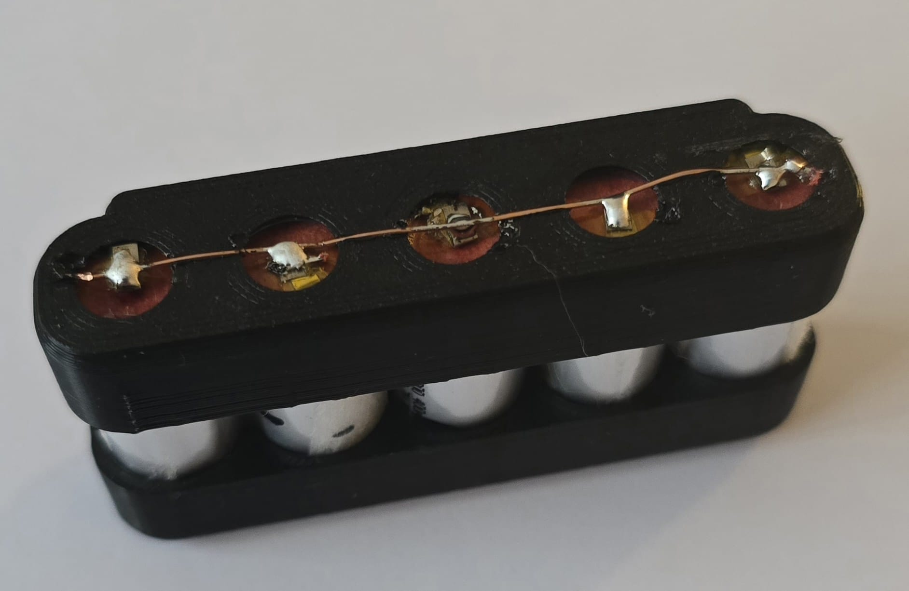
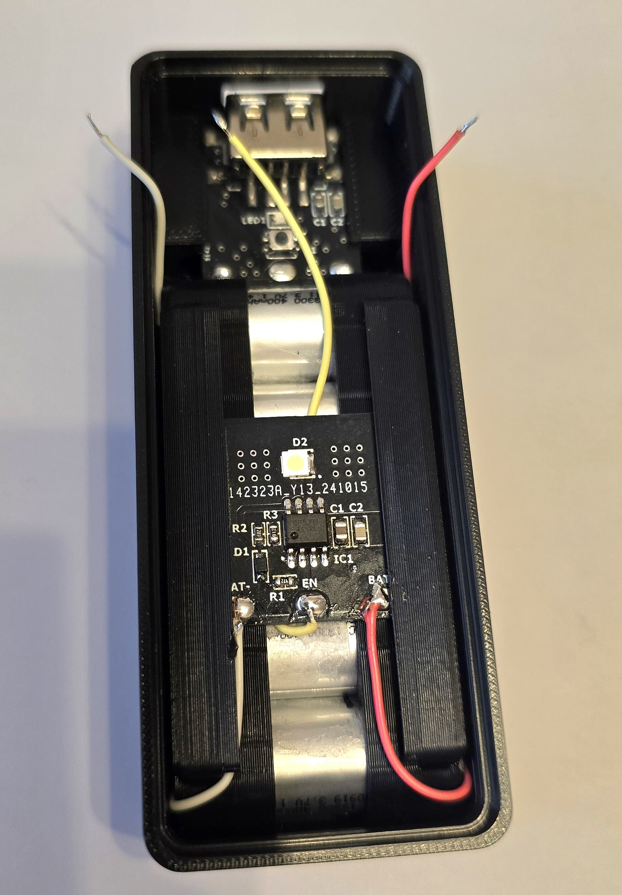
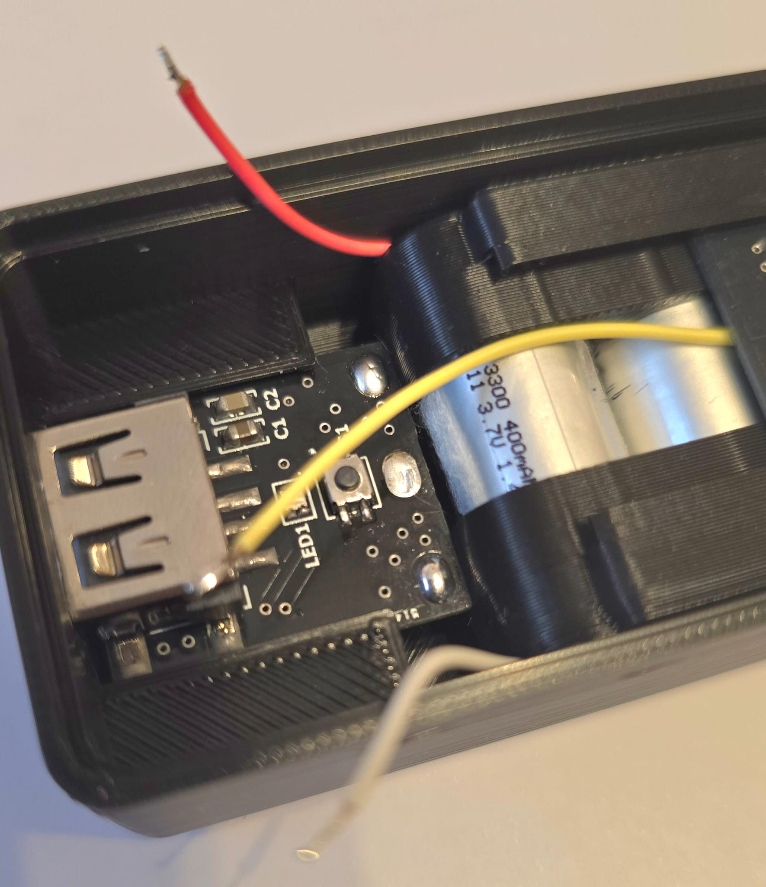
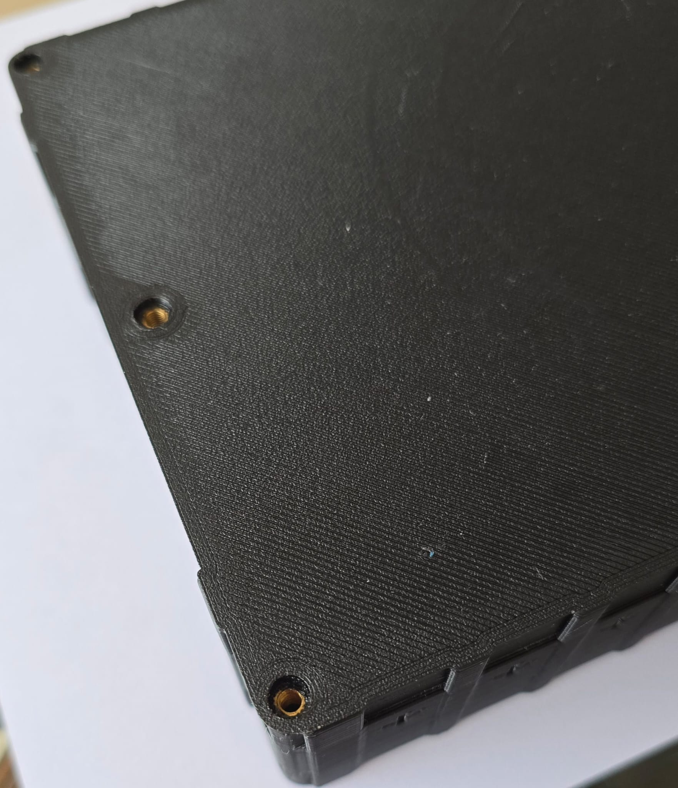
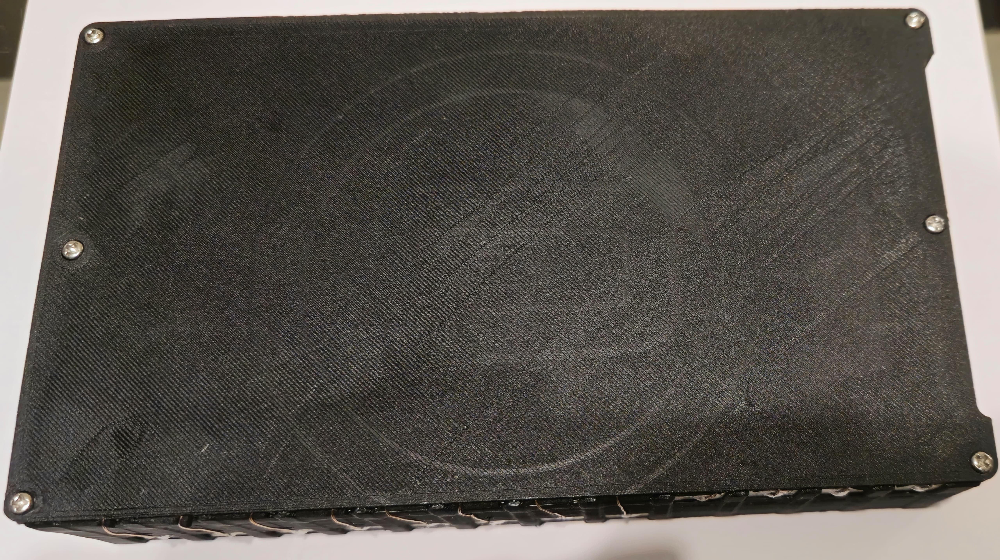
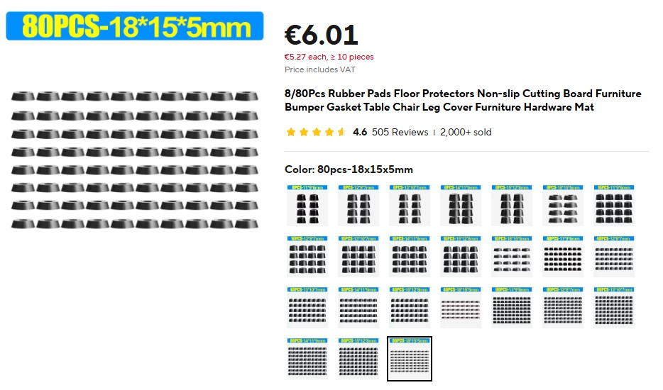

# salt-energy

## Introduction

This project provides practical solutions for repurposing disposable vape batteries to power devices like power banks and other rechargeable electronics. 
By transforming these short-lived products into useful, long-lasting devices, we aim to reduce electronic waste and extend the life cycle of valuable components.

Through this project, you'll learn how to convert the batteries from disposable vapes into reliable power sources, contributing to a more sustainable future. 
Whether you're an eco-conscious creator or a DIY enthusiast, this guide offers straightforward solutions for reducing waste and promoting energy efficiency.

## Vape batteries

Each device contains `li-ion` battery that in most cases can be categorized as follows:

### 1. Flat battery

- Cell Model: 801437
- Size: 80mm x 14mm x 37mm
- Li-ion 3.7V 400mAh

### 2. Round big battery

- Cell Model: 13400
- Size: 13mm x 40mm
- Li-ion 3.7V 550mAh

### 3. Round small battery

- Cell Model: 13300
- Size: 13mm x 30mm
- Li-ion 3.7V 400mAh

All project utilize one or many of this batteries

## Table of Contents

- [Salt AA Battery](#salt-aa-battery)
- [Ptero Power Bank](#ptero-power-bank)
- [Moskito Power Bank](#moskito-power-bank)
- [Lampyrida LED Lamp](#lampyrida-led-lamp)
- [Quazar Battery Pack](#quazar-battery-pack)
- [Solr Power Station](#solr-power-station)

## Salt AA Battery

Rechargeable rectangular AA battery, with discharge current up to 2A and quiescent current <25uA

### Specification

- Size: 50mm x 14mm x 14mm
- Capacity: 400 mAh
- Battery count: 1
- Battery type: [Flat battery](#1-flat-battery)

#### Battery PCB

The heart of this battery is custom designed board with charger(`TP4057`), protection(`XB7608A`) and step-down converter(`TPS62A02`).

#### USB type C PCB

#### JLCPCB quote example

 
 

***Note:*** All required fabrication and BOM can be found in `altium` directory.

### Prerequisites

The project contains `solidworks` source models and `stl` directory with all required models for 3D printing.
All that needs to assembly a single device:
- 1x - Battery (see [Specification](#specification))
- 2x - Battery contacts (***Only positive contact required***). Can be found in `Aliexpress`, `Ebay` or `Amazon` by description: `Battery AA AAA Battery Positive to Negative Spring Plate Set`
    - Material: Metal 
    - Fit for: AA, AAA Batteries
    - Length: 9mm（0.35in), Wide: 8mm（0.31in）
- 1x -`main-board` -> ***Soldered***
- 1x -`usb-board` -> ***Soldered***
- 1x -`battery_aa_case.STL` -> ***Resolution: 0.1, Walls: 1, Infill: 100%, Supports: Yes, Filament material: PLA***
- 1x -`battery_aa_lid.STL` -> ***Resolution: 0.1, Walls: 1, Infill: 100%, Supports: Yes, Filament material: PLA***
  
***Additional:*** Some wires and epoxy or adhesive(B-7000) glue required

### Assembly

#### 1. Prepare battery contacts and solder USB wires

#### 2. Solder main PCB to battery

***Note:*** Do not forget to put isolator between battery terminals

#### 3. Set USB PCB to the case

 
 

#### 4. Insert battery and board to the case

- 
- 

#### 5. Glue up positive and negative contacts

- 
- 
- 

#### 6. Solder positive, negative and USB contacts to battery PCB

#### 7. Check that charger works and battery output 1.5V

- 
- 

#### 8. Glue up battery lid

- 
- 

#### 9. Fully charge battery

---

## Ptero Power Bank

Cheap and powerful power bank with quick charge support

### Specification

- Size: 165mm x 74mm x 22mm
- Capacity: 9200 mAh
- Battery count: 23
- Battery type: [Flat battery](#1-flat-battery)

Based on the popular power bank charging module:

Can be found in `Aliexpress` or `Amazon` by number: `H961-U` or by description: `Dual USB 5V 2.4A Micro/Type-C USB Mobile`

### Prerequisites

The project contains `SolidWorks` source models and `stl` directory with all required models for 3D printing.
All that needs to assembly a single device:
- 23x - Batteries (see [Specification](#specification))
- 1x - Power Bank PCB
- 6x - M3 bolts 10-14mm
- 6x - M3 brass inserts (4-6mm x 4.2mm)
- 1x -`body_top.STL` -> ***Resolution: 0.2, Walls: 2–3, Infill: 50%+, Supports: No, Filament material: PLA***
- 1x -`body_bottom.STL` -> ***Resolution: 0.2, Walls: 2–3, Infill: 50%+, Supports: Yes, Filament material: PLA***
- 2x -`battery_holder_8x.STL` -> ***Resolution: 0.2, Walls: 1, Infill: 100%, Supports: No, Filament material: PLA***
- 1x -`battery_holder_7x.STL` -> ***Resolution: 0.2, Walls: 1, Infill: 100%, Supports: Yes, Filament material: PLA***
- 1x -`display_glass.STL` -> ***Resolution: 0.12, Walls: 2, Infill: 2%, Supports: No, Filament material: Transparent PLA***
- 1x -`button.STL` -> ***Resolution: 0.12, Walls: 2, Infill: 100%, Supports: No, Filament material: PLA***

***Additional:*** Nickel plated strip (0.1mm x 6-10mm) and some wires to solder batteries

### Assembly

#### 1. Place batteries in holders and solder them in parallel

 

 
***Note:*** It's better to use copper wire from UTP internet cable to connect batteries

 
***Note:*** Do not forget to isolate contacts as in photo, or as alternative hot glue can be used

#### 2. Set brass inserts to the top lid

 

#### 3. Place display glass

 

***Note:*** No need of any glue.

#### 4. Insert button to the place

 

#### 5. Place PCB board as follows

 
 

***Note:*** Check button by clicking on it several times

#### 6. Place prepared batteries

 

#### 7. Solder wires to nickel strip

 
 

***Note:*** Cut strip with additional 0.5cm at the end, for better fixation melt it a little with soldering iron to the holder case

 

#### 8. Place and screw up the lid

 

Charge and check the capacity. Then your device is ready

---

## Moskito Power Bank

Pocket-size power bank with build in flashlight

### Specification

#### Small

- Size: 96mm x 37mm x 23mm
- Capacity: 2000 mAh
- Battery count: 5
- Battery type: [Round small battery](#3-round-small-battery)

#### Large

- Size: 97mm x 47mm x 23mm
- Capacity: 2750 mAh
- Battery count: 5
- Battery type: [Round big battery](#2-round-big-battery)

#### Power Bank PCB

The custom designed board is based on a cheap power bank IC `TP4333`.

#### Flashlight PCB

Flashlight board contains powerful LED and driver IC `CN5711`.

#### JLCPCB quote example

 
 

***Note:*** Additional information, fabrication and BOM can be found in `altium` directory.

### Prerequisites

The project contains `SolidWorks` source models and `stl` directory with all required models for 3D printing.
All that needs to assembly a single device:
- 5x - Batteries (see `Specification`)
- 1x - Power Bank PCB
- 1x - Flashlight PCB
- 1x -`pb_body_sm.STL` -> ***Resolution: 0.2, Walls: 2–3, Infill: 50%+, Supports: No, Filament material: PLA***
- 2x -`pb_battery_holder_5s.STL` -> ***Resolution: 0.2, Walls: 1, Infill: 100%, Supports: No, Filament material: PLA***
- 1x -`pb_button_sm.STL` -> ***Resolution: 0.2, Walls: 1, Infill: 100%, Supports: Yes, Filament material: PLA***
- 1x -`pb_top_lid_sm.STL` -> ***Resolution: 0.2, Walls: 2, Infill: 25%, Supports: No, Filament material: Transparent PLA***  

***Additional:*** Some wires and epoxy or adhesive(B-7000) glue required

***Note:*** For larger power bank uses same PCBs and files with `_lg` postfix.

### Assembly

#### 1. Place batteries in holder and solder them in parallel

 
 

***Note:*** Copper wire from UTP internet cable is recommended to connect batteries

#### 2. Set flashlight PCB and solder wires

 
 

Connect signal `EN` wire to battery `+` to check that flashlight works 
 

#### 3. Next place power bank PCB as follows

 
 

#### 4. Place battery module

 
 

***Note:*** Battery module should tightly fit

#### 5. Solder connection wires

 

#### 6. Check that power bank works as expected

- Short button press and power bank should be enabled:
  -  
- Long press and flashlight should be on or off
- Connect device to the charger and green LED should blink
- Check output voltage: `5V` and load current: `0.8A - 1A`

#### 7. Glue up power bank lid with button

 
 
 

#### 8. Optionally, set keychain

 

#### 9. Fully charge power bank

---

## Lampyrida led lamp

Small and portable LED lamp with dimming feature

### Specification

- Size: 60mm x 78mm
- Capacity: 1600 mAh
- Battery count: 4
- Battery type: [Round small battery](#3-round-small-battery)

#### LED lamp PCB

The custom designed board is based on MCU (`Attiny13`), LED driver (`CN5711`) and charger (`TP4056`).

#### JLCPCB quote example

 

- ***Note:*** Additional information, fabrication and BOM can be found in `altium` directory.
- ***Note:*** Firmware can be found in `attiny13-pwm-light` directory

### Prerequisites

The project contains `SolidWorks` source models and `stl` directory with all required models for 3D printing.
All that needs to assembly a single device:
- 4x - Batteries (see `Specification`)
- 1x - Led lamp PCB (soldered and programmed)
- 4x - M3 bolts 8-10mm
- 4x - M3 brass inserts (5-6mm x 4.2mm)
- 1x -`lamp_body.STL` -> ***Resolution: 0.2, Walls: 2–3, Infill: 25%-50%, Supports: No, Filament material: PLA***
- 1x -`lamp_battery_holder.STL` -> ***Resolution: 0.2, Walls: 1, Infill: 25%, Supports: No, Filament material: PLA***
- 1x -`lamp_button.STL` -> ***Resolution: 0.2, Walls: 1, Infill: 100%, Supports: No, Filament material: PLA***
- 1x -`lamp_reflector.STL` -> ***Resolution: 0.2, Walls: 2, Infill: 10%-15%, Supports: No, Filament material: Transparent PLA***

***Additional:*** Bunch of wires to connect batteries

### Assembly

#### 1. Set brass inserts to the reflector

 

#### 2. Place batteries in holder and solder them in parallel

 
 

***Note:*** Copper wire from UTP internet cable is recommended to connect batteries

#### 2. Place battery module

 

***Note:*** Module should tightly fit and push it until you hear 'click'

#### 3. Place switch button

 
 

#### 4. Place PCB board and solder battery wires

 
 

#### 5. Check that battery charger works

 

***Note:*** Additionally check that board works as expected by pushing switch button

#### 6. Put lamp reflector and screw the screws

 
 

---

## Quazar Battery Pack

Small but powerful battery module 12V 30Ah. Perfectly fit to store energy from solar panels

### Specification

- Size: 221mm x 128mm x 45mm
- Capacity: 24000 mAh
- Battery count: 180
- Battery type: [Flat battery](#1-flat-battery)

#### Battery Charger Protection Board:

### Prerequisites

The project contains source models and `stl` directory with all required models for 3D printing.
All that needs to assembly a single device:
- 180x - Batteries (see [Specification](#specification))
- 6x - M3 bolts 8-10mm
- 12x - M3 brass inserts (8-10mm x 4.2mm)
- 1x - BMS board
- 1x -`quazar_body_15x12.STL` -> ***Resolution: 0.2, Walls: 2–3, Infill: 15-25%, Supports: No, Filament material: PLA***
- 1x -`quazar_body_15x12.STL` -> ***Resolution: 0.2, Walls: 2–3, Infill: 15-25%, Supports: No, Filament material: PLA***

***Additional:*** Nickel plated strip `0.2mm x 6-10mm` and uncoated copper wire `1mm` to solder batteries

### Assembly

#### 1. Set brass inserts in top and bottom of a battery body

 
 

#### 2. Insert nickel plated strip as follows

 
 

#### 3. Tuck the nickel strip using flat screwdriver

 

#### 4. Place BMS PCB

 

#### 5. Place batteries as follows

 

#### 6. Solder batteries in parallel using copper wire

 

#### 7. Solder connected batteries to nickel strip according it polarity

 

#### 8. Check connections and measure voltage for each cell
#### 9. Solder nickel strip ends to BMS board and check output voltage
#### 10. Screw up the lid

 

#### 10. Charge battery and check it capacity

---

## Solr Power Station

Portable and cost efficient 300W power station.

### Features

- Output: USB/USB-C with fast charge support
- Output: 12V up to 30A. Can boil water in 20 min
- Output: AC: 220V 60W
- Input: 12V from solar panels

### Tradeoffs

- Low power AC output
- LCD show only battery capacity and voltage, no power consumption monitoring

***TODO:*** Implement custom DC to AC inverter and display to overcome such tradeoffs

### Specification

- Size: 237mm x 175mm x 140mm
- Battery pack: [Quazar Battery](#quazar-battery-pack)

### Solr Controller Board

Arduino based board used to protect device and control cooling fan according to current consumption 

### Prerequisites

The project contains source models in `solidworks` directory with all required models for 3D printing.
Solidworks format `.SLDPRT` can be easily converted to `.stl` using online tools or using CAD plugins in slicer tool
All that needs to assembly a single device:
- 1x - [Quazar Battery](#quazar-battery-pack)
- 14x - M3 brass inserts `12-14mm x 4.2mm` (for 2x lid mounting to the body)
- 14x - M3 bolts `12-14mm` (2x lid mounting)
- 14x - M3 bolts `5-6mm` (ac inverter, solr controller, XT-60, and rubber pads mounting)
- 2x - M3 bolts `10mm` (battery to body mounting)
- 14x - M3 nuts (PCBs, pads, XT-60)
- 2x - M3 washers `7mm` (battery to body mounting)
- 2x - M4 bolts `5mm` (protection fuse mounting)
- 6x - M4 bolts `20mm` (Hanger and Fan mounting)
- 8x - M4 bolts `10mm` (AC sockets mounting)
- 16x - M4 nuts
- 2x - M5 nuts (fuse wire mounting)
- 4x - M5 washers (Optionally: place it between crimp connections)
- 2x - M8 bolts `30mm` (DC output wires mounting)
- 4x - M8 nuts
- 4x - M8 washers (Optionally: place it between crimp connections)
- 7x - M8 round pre-insulated crimp terminals (ac inverter-2x, car socket inputs-2x and PCB-2x, XT-60(GND)-1x outputs)
- 4x - M5 round pre-insulated crimp terminals(dc switch-2x, XT-60(+)-1x, Battery(+)-1x)
- 4x - Pre-insulated fork crimp terminals (AWG16-14) `Blue`
- 1x -`ps_back_lid.SLDPRT` -> ***Resolution: 0.2, Walls: 2–3, Infill: 15-25%, Supports: No, Filament material: PLA, Adhesion: Brim***
- 1x -`ps_body.SLDPRT` -> ***Resolution: 0.2, Walls: 2–3, Infill: 15-25%, Supports: No, Filament material: PLA***
- 1x -`ps_front_lid.SLDPRT` -> ***Resolution: 0.2, Walls: 2–3, Infill: 15-25%, Supports: No, Filament material: PLA***
- 1x -`ps_hanger.SLDPRT` -> ***Resolution: 0.2, Walls: 2–3, Infill: 15-25%, Supports: No, Filament material: PLA***
- 1x -`ps_label.SLDPRT` -> ***Resolution: 0.2, Walls: 2–3, Infill: 100%, Supports: No, Filament material: PLA***

***Additional:***
- Copper wire Diameter: `3mm`, AWG: `8-9` (DC connections)
- Copper wire Diameter: `1.5mm`, AWG: `14-15` (AC connections)

### DC to AC converter board

- Count: 1

### Battery capacity meter

***Appearance size:*** `61mm*40mm*22mm`
- Count: 1

### Additional overcurrent protection

- Count: 1

### AC output socket

- Count: 2

### DC output socket

- Count: 1

### DC input socket

- Count: 1

### On/Off DC switch

- Count: 1

### Cooling fan

- Count: 1

### Rubber pads

- Count: 4

---
